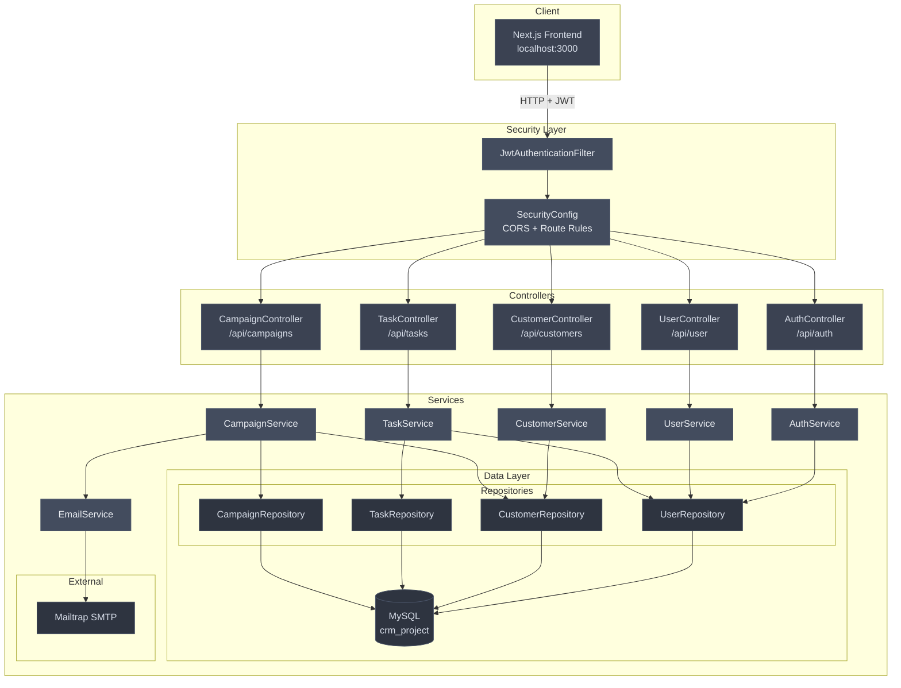
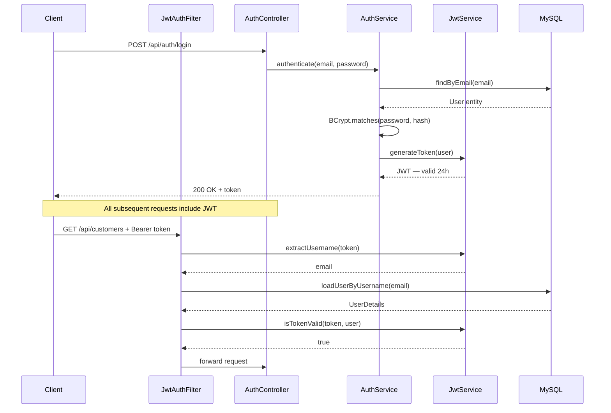
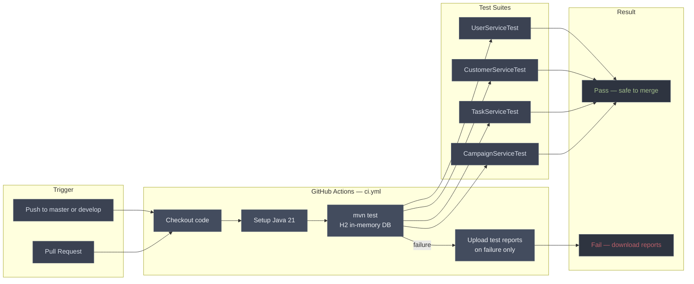

# CRM Backend

> Spring Boot 4 · Spring Security · JWT · MySQL · Java 21

A REST API for a CRM application with full CRUD for customers, tasks, and campaigns. Includes JWT authentication and email sending via Mailtrap.

---

## Tech Stack

| Technology | Version | Purpose |
|-----------|---------|---------|
| Spring Boot | 4.0.5 | Framework |
| Spring Security | 4 | Authentication |
| Spring Data JPA | 4 | ORM |
| MySQL | 8 | Production database |
| H2 | — | Test database |
| JWT (jjwt) | 0.11.5 | Token auth |
| Spring Mail | 4 | Email sending |
| Lombok | — | Boilerplate reduction |
| Maven | 3.9 | Build tool |

---

## System Architecture



---

## Authentication Flow



---

## API Endpoints

### Auth — public

| Method | Endpoint | Description |
|--------|----------|-------------|
| POST | `/api/auth/register` | Register new user |
| POST | `/api/auth/login` | Login — returns JWT |

### User — protected

| Method | Endpoint | Description |
|--------|----------|-------------|
| GET | `/api/user/me` | Get current user |
| PATCH | `/api/user/me/name` | Update name |
| PATCH | `/api/user/me/password` | Update password |
| POST | `/api/user/logout` | Logout |

### Customers — protected

| Method | Endpoint | Description |
|--------|----------|-------------|
| GET | `/api/customers` | Get all customers |
| GET | `/api/customers/:id` | Get by ID |
| POST | `/api/customers` | Create customer |
| PUT | `/api/customers/:id` | Update customer |
| DELETE | `/api/customers/:id` | Delete customer |

### Tasks — protected

| Method | Endpoint | Description |
|--------|----------|-------------|
| GET | `/api/tasks` | Get all tasks |
| GET | `/api/tasks/:id` | Get by ID |
| POST | `/api/tasks` | Create task |
| PUT | `/api/tasks/:id` | Update task |
| PUT | `/api/tasks/:id/assign/:userId` | Assign to user |
| PUT | `/api/tasks/:id/unassign` | Unassign |
| DELETE | `/api/tasks/:id` | Delete task |

### Campaigns — protected

| Method | Endpoint | Description |
|--------|----------|-------------|
| GET | `/api/campaigns` | Get all campaigns |
| GET | `/api/campaigns/:id` | Get by ID |
| POST | `/api/campaigns` | Create campaign |
| PUT | `/api/campaigns/:id` | Update campaign |
| POST | `/api/campaigns/:id/send` | Send to all customers |
| DELETE | `/api/campaigns/:id` | Delete campaign |

---

## CI/CD Pipeline



---

## Getting Started

**1. Clone the repo**
```bash
git clone <repo-url>
cd crm-backend
```

. Create `.env` in the project root**
```
DB_URL=jdbc:mysql://localhost:3306/crm_project
DB_USERNAME=your_db_username
DB_PASSWORD=your_db_password
JWT_SECRET=your_base64_secret
MAIL_HOST=sandbox.smtp.mailtrap.io
MAIL_PORT=2525
MAIL_USERNAME=your_mailtrap_username
MAIL_PASSWORD=your_mailtrap_password
```

**3. Create MySQL database**
```sql
CREATE DATABASE crm_project;
CREATE USER 'minicrm_user'@'localhost' IDENTIFIED BY 'your_password';
GRANT ALL PRIVILEGES ON crm_project.* TO 'minicrm_user'@'localhost';
```

**4. Run the application**
```bash
./mvnw spring-boot:run
```

API available at `http://localhost:9090`

---

## Running Tests

```bash
./mvnw test
```

Tests use H2 in-memory database — no MySQL required.

---

## Environment Variables

| Variable | Description |
|----------|-------------|
| `DB_URL` | MySQL connection URL |
| `DB_USERNAME` | MySQL username |
| `DB_PASSWORD` | MySQL password |
| `JWT_SECRET` | Base64 encoded secret key |
| `MAIL_HOST` | SMTP host |
| `MAIL_PORT` | SMTP port |
| `MAIL_USERNAME` | SMTP username |
| `MAIL_PASSWORD` | SMTP password |


---
## Package Structure

```
com.GL.CRM/
│
├── auth/
│   ├── controller/
│   │   └── AuthController.java
│   └── service/
│       └── AuthService.java
│
├── user/
│   ├── controller/
│   │   └── UserController.java
│   ├── service/
│   │   └── UserService.java
│   ├── entity/
│   │   ├── User.java
│   │   └── Role.java               (ADMIN · USER)
│   ├── dto/
│   │   ├── UserResponse.java
│   │   ├── UpdateNameRequest.java
│   │   └── UpdatePasswordRequest.java
│   └── repository/
│       └── UserRepository.java
│
├── customer/
│   ├── controller/
│   │   └── CustomerController.java
│   ├── service/
│   │   └── CustomerService.java
│   ├── entity/
│   │   └── Customer.java
│   ├── dto/
│   │   ├── CustomerRequest.java
│   │   └── CustomerResponse.java
│   ├── mapper/
│   │   └── CustomerMapper.java
│   └── repository/
│       └── CustomerRepository.java
│
├── task/
│   ├── controller/
│   │   └── TaskController.java
│   ├── service/
│   │   └── TaskService.java
│   ├── entity/
│   │   ├── Task.java
│   │   ├── TaskType.java           (CALL · MEETING · EMAIL · FOLLOW_UP · DEMO)
│   │   ├── TaskStatus.java         (TODO · IN_PROGRESS · DONE · CANCELLED)
│   │   └── TaskPriority.java       (LOW · MEDIUM · HIGH · URGENT)
│   ├── dto/
│   │   ├── TaskRequest.java
│   │   └── TaskResponse.java
│   ├── mapper/
│   │   └── TaskMapper.java
│   └── repository/
│       └── TaskRepository.java
│
├── campaign/
│   ├── CampaignController.java
│   ├── CampaignService.java
│   ├── CampaignRepository.java
│   ├── CampaignMapper.java
│   ├── Campaign.java
│   ├── CampaignRequest.java
│   ├── CampaignResponse.java
│   ├── CampaignStatus.java         (DRAFT · SENT)
│   └── EmailService.java
│
├── security/
│   ├── JwtService.java
│   ├── JwtAuthenticationFilter.java
│   ├── SecurityConfig.java
│   ├── ApplicationConfig.java
│   └── GlobalExceptionHandler.java
│
└── exception/
    └── ResourceNotFoundException.java
```